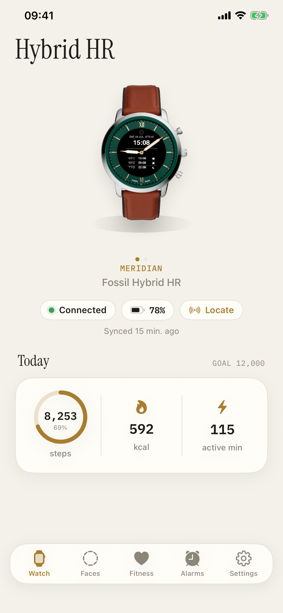
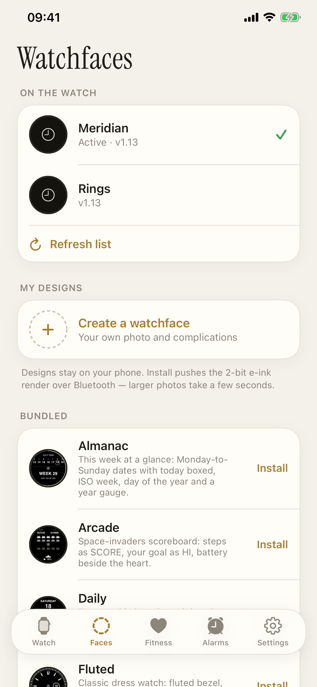
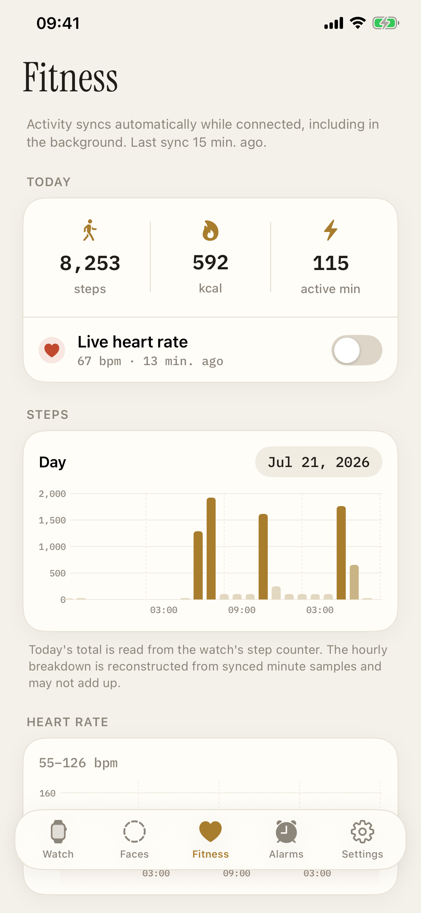
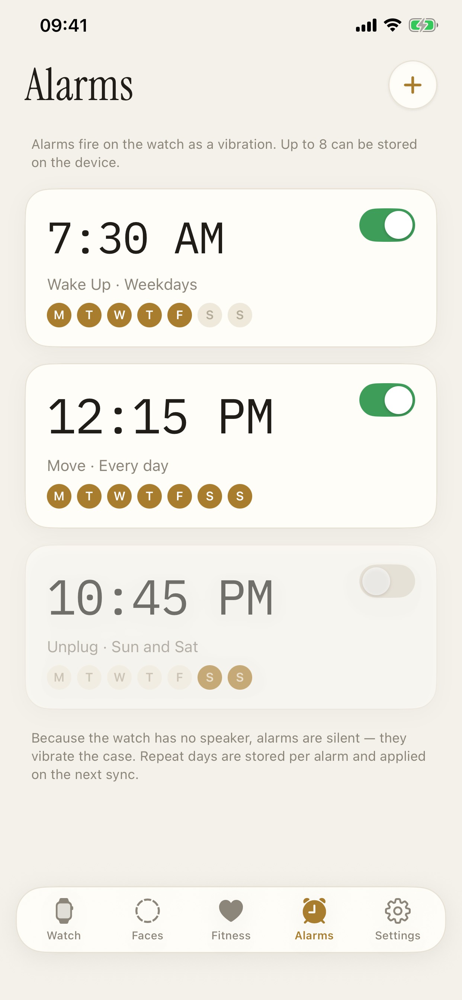
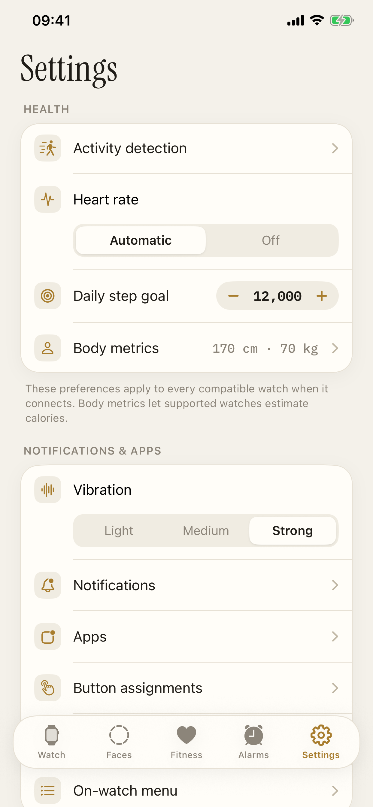
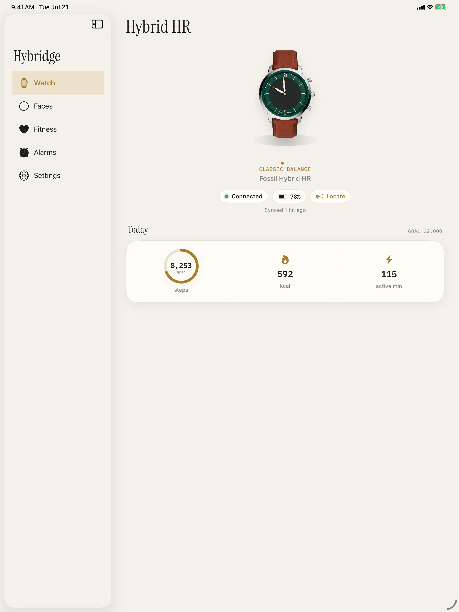
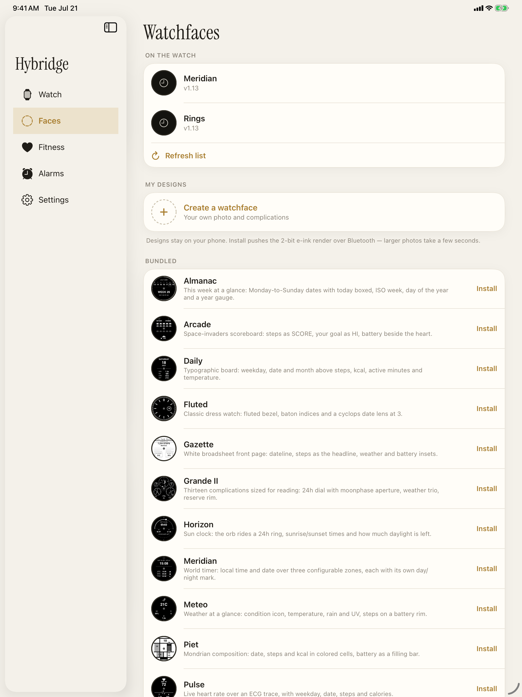
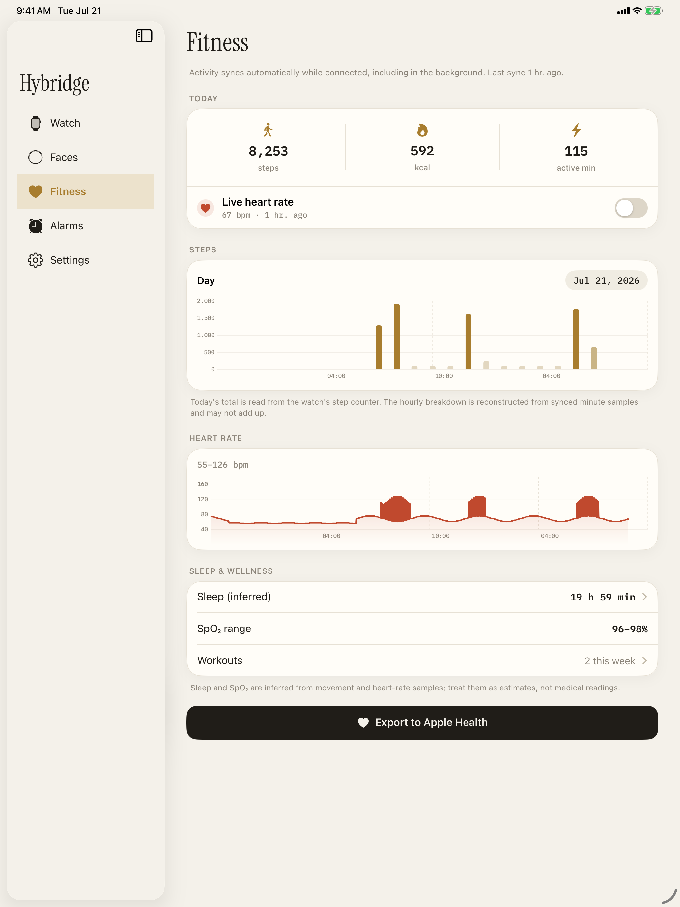
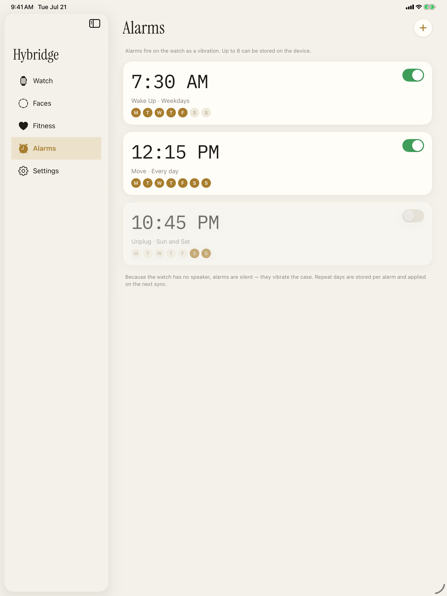
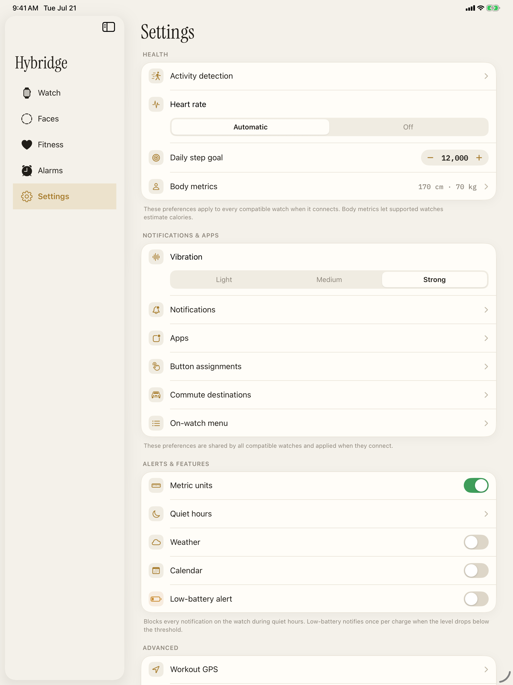

# Hybridge - unofficial iPhone companion for Fossil hybrid watches - 99% vibe-coded

A SwiftUI app that is an independent alternative to the official Fossil app
for the **Fossil Hybrid HR** family (Collider etc.) and the older **non-HR Q
hybrids** (e.g. the Q Grant - physical hands only, no display). (The official
app is **not** discontinued as of this writing; it may be retired in the
future, but that is uncertain - so it is not described as retired anywhere in
this project or its App Store copy.) Several watches can be added; the app manages
one at a time and its screens adapt to the active watch's capabilities.

## Screenshots

### iPhone

| Watch | Watchfaces | Fitness | Alarms | Settings |
| --- | --- | --- | --- | --- |
|  |  |  |  |  |

### iPad

| Watch | Watchfaces | Fitness | Alarms | Settings |
| --- | --- | --- | --- | --- |
|  |  |  |  |  |

## Features (Hybrid HR)

- Connect to the watch and authenticate with your extracted 16-byte key
  (entered once, stored in the iOS Keychain)
- Battery level, firmware version, protocol log (hex trace for debugging)
- Set the watch time (encrypted configuration write)
- Alarms: create/edit locally, push to the watch
- Settings: daily step goal, vibration strength, metric/imperial units
- Watchfaces:
  - list watchfaces installed on the watch, activate or delete them
  - **build custom watchfaces**: photo background (converted to the watch's
    2-bit e-ink format), up to 4 complications (date, steps, HR, battery,
    calories, active minutes, SpO2 and weather - temperature, condition,
    chance of rain, UV index) placed by
    dragging on a live preview, then upload & activate
- Phone integration (Settings -> Find my phone / Weather / Calendar):
  - Music: handled entirely by iOS, not by this app. Once the watch is bonded,
    iOS gives it native media control over AMS (play/pause, next/previous,
    track metadata and system volume, for whatever app is currently playing
    (Apple Music, Spotify, a browser video…), foreground or background). There
    is no music setting to configure on the Hybrid HR
  - Find my phone: watch-triggered ringtone + vibration, with a test button -
    rings while the app is open; with it backgrounded the watch's event still
    arrives over BLE and posts a notification you tap to ring
  - Calendar: pushes up to 5 upcoming events to watchfaces/apps that render
    them (EventKit, `NSCalendarsFullAccessUsageDescription`)
  - Weather: WeatherKit feeds current conditions (temperature, condition,
    chance of rain, UV index) to watchfaces/apps that request them; a fresh
    fix is taken with "When in Use" location while foregrounded and cached, so
    the watch's background requests never need Always access
    (`com.apple.developer.weatherkit`)
  - Quiet hours: a daily window (e.g. bedtime) that blocks every watch
    notification, on or off, no per-app level - Settings -> Quiet hours, or
    "Quiet now" for a one-off override until the next boundary
  - Workout GPS: starting a workout on the watch has the phone record GPS
    distance and feed it back to the watch; the recording continues in the
    background (with the blue location indicator showing) if you pocket the
    phone, and stops when the workout ends. Uses "When in Use" location only.
    Settings -> Advanced -> Workout GPS runs the same recording from the app so
    you can verify it without starting a watch workout
  - Home Assistant: Settings -> Advanced -> Home Assistant stores a long-lived
    access token in Keychain and lets you choose up to 11 ordered entities for
    `homeAssistantApp.wapp`. Lights expose toggle/brightness controls, climate
    entities expose HVAC mode/temperature controls, and other entities are
    available as read-only cards. Local HTTP and remote HTTPS instance URLs
    are supported.
- Siri Shortcuts / App Intents: sync activity, vibrate the watch, set quiet
  mode (on/off/auto), add an alarm - all launchable from Shortcuts/automations
  even with the app not running (the intents wait out the same
  reconnect-and-init chain a background refresh does)

Notifications (SMS etc.) are delivered by iOS itself via ANCS once the watch
is bonded to the iPhone - the app manages the on-watch notification config
(which apps, with which icons), not the delivery.

## Features (Q hybrids, e.g. Q Grant)

The older Q watches speak the same file protocol without encryption - **no
authentication key is needed**. The watch family is detected automatically
from the firmware version on first connect (first-generation "Misfit-era"
Q firmware is detected but not supported). Supported:

- Set time (the hands jump - also the quickest connection check), battery &
  step count, find-my-watch vibration
- Activity/step sync into the same Fitness tab (steps, calories, active
  minutes; no heart rate - the watch has no sensor)
- Alarms (the watch's legacy format; no labels)
- Notifications as **hand positions + vibration**: assign apps (App Store
  search resolves the bundle ID) or contacts (system contact picker;
  call/text alerts) to clock positions - the hands point there when a
  matching notification arrives. Matches the official app's on-watch file
  byte for byte.
- Button assignments: date, stopwatch, second time zone, step-goal progress,
  music control, volume, find my phone, forward to phone, and the official
  **"alternate"** mode that cycles the small dial through
  alert / time 2 / alarm / date
- Multi-press mapping: a button set to "forward to phone (multi-press)"
  reports single/double/long presses, each mappable to a phone action -
  e.g. volume up on single press and volume down on double, on one button
- Hand calibration for all three hands, including the small dial

HR-only screens (watchfaces, apps, weather, calendar,
translations…) are hidden while a Q watch is active.

## Multiple watches

Settings -> My Watches keeps a roster. Each watch has its own settings,
auth key (HR only), alarms, button config and notification setup; fitness
data is merged into one dataset tagged per watch. Switching the active
watch reconnects and reloads everything scoped to it.


## License

MIT — see [`LICENSE`](LICENSE). © 2026 Jonathan Foucher.

### Acknowledgements

- **Fonts** (`Resources/fonts/`): IBM Plex Mono (© 2017 IBM Corp.) and
  Instrument Serif (© 2022 The Instrument Serif Project Authors), both under
  the SIL Open Font License 1.1 — see [`Resources/fonts/OFL.txt`](Resources/fonts/OFL.txt).
- **Gadgetbridge** (AGPL-3.0): the BLE protocol here is an independent
  implementation of the Fossil `qhybrid` protocol, cross-checked for
  correctness against Gadgetbridge's `qhybrid` support. No Gadgetbridge code or
  assets are included, so no AGPL obligation attaches — the nod is a good-faith
  credit to the work that made this possible.
- **Bundled watchfaces** (`Resources/bundled_faces/`) are author-original,
  built with this project's own `moon-watch` pipeline.

Full notices in [`THIRD-PARTY.md`](THIRD-PARTY.md).

## Building & installing

Requirements: Xcode (tested with 26.x), an iPhone (iOS 17+), and
[XcodeGen](https://github.com/yonaskolb/XcodeGen) - `brew install xcodegen`.

1. `Hybridge.xcodeproj` is generated from `project.yml` and is **not checked
   in**, so generate it after cloning (and again after any `project.yml`
   change). Never edit the project in Xcode's inspector - the change will be
   overwritten on the next generate; edit `project.yml` instead.

   ```sh
   xcodegen generate
   open Hybridge.xcodeproj
   ```

2. In Xcode, select **both** the **Hybridge** and **HybridgeWidgets** targets
   -> *Signing & Capabilities* -> choose your Team on each (a free Apple ID
   works; the app then expires after 7 days and must be re-installed - a
   paid developer account extends this to a year). Automatic signing then
   registers the `group.eu.sixpixels.hybridge` app group on both bundle ids
   - this is what lets the widgets read the snapshot the app writes. Free
   personal teams support app groups; the widget extension is a second app
   id and counts toward the free-team 10-ids/week quota. If that identifier
   is already taken, change it in `project.yml` (both the `Hybridge` and
   `HybridgeWidgets` target blocks) and `WidgetStore.appGroupID`, then
   `xcodegen generate` again.

3. For weather push, enable the **WeatherKit** capability on the App ID
   (developer.apple.com -> Identifiers -> `eu.sixpixels.hybridge`), then let
   Xcode regenerate the provisioning profile. Without this, WeatherKit
   requests fail immediately - the rest of the app works fine regardless.

4. Plug in your iPhone, select it as the run destination, press Run.

## First connection

1. Make sure the watch is **not** connected to the old Fossil app or another
   phone (uninstall/force-quit the old app; if the watch was paired in
   Settings -> Bluetooth, forget it; reboot the watch if it doesn't show up -
   press and hold the middle button).
2. Open the app, tap **Scan**, select your watch. If a Q watch doesn't
   appear, flip on **Show all devices** (its advertised name may not match
   the usual filter).
3. **Hybrid HR only:** when asked, enter your watch's **authentication key**
   (32 hex characters — see [Getting your authentication
   key](#getting-your-authentication-key-hybrid-hr-only) below). Q hybrids are
   unencrypted and need no key.
4. The app fetches device info, detects the watch family from its firmware,
   sets the time, and (on the HR) authenticates and lists the installed
   watchfaces.

## Getting your authentication key (Hybrid HR only)

The Hybrid HR encrypts its file protocol with a **per-watch 16-byte key**. The
watch never sends this key over Bluetooth — it only ever lived in the official
app and on Fossil's servers — so the app can't fetch it for you. You bring your
own. There are three ways to get it:

- **From the Fossil cloud API** with the `scripts/fetch_keys.py` helper below —
  the easiest if you still have your old Fossil account login.
- **Captured from the official app** (e.g. its logs/backup) before you stopped
  using it.
- **From a backup** of the official app or a Gadgetbridge export.

### Using `scripts/fetch_keys.py`

This small script logs in to Fossil's cloud with *your own* account email and
password and prints the keys for every HR watch on your account — the same keys
the official app downloaded when you first set the watch up. It talks only to
Fossil's server, only about your account, and stores nothing.

1. **Install Python** (3.8+) if you don't have it. Check with `python3
   --version`. If that fails:
   - **macOS:** `brew install python` (or download from
     [python.org](https://www.python.org/downloads/)).
   - **Windows:** install from [python.org](https://www.python.org/downloads/)
     and tick *"Add python.exe to PATH"* during setup.
   - **Linux:** it's almost always already there (`sudo apt install python3
     python3-pip` on Debian/Ubuntu if not).

2. **Run it** and type your Fossil account email and password when prompted
   (the password is hidden as you type and is never saved anywhere):

   ```sh
   python3 scripts/fetch_keys.py
   ```

   It has no third-party dependencies and uses only Python's standard library.
   Run it only on a computer you control. If the vendor serves a browser-only
   Cloudflare challenge, the script exits without sending credentials anywhere
   else.

   For Skagen/Citizen-branded hybrids use `--brand skagen` / `--brand citizen`.

   Keys are redacted by default. Re-run locally with `--show-keys` to explicitly
   print one line per watch: `device id` and the 32-hex-character key. Copy
   the key for your watch and paste it into Hybridge's **Auth key** screen
   (Settings → My Watches → your watch → Auth key). Spaces and a `0x` prefix
   are ignored on paste.

Do not paste the script or your Fossil credentials into Colab, an online code
runner, or another third-party service. Local execution keeps the password on
your own computer.

> **Is this legal?** The script is original code (MIT-licensed like the rest of
> this repo) — it contains none of Fossil's software or keys. It only retrieves
> **your own** keys for watches **you own**, using **your own** credentials,
> which is the same thing the official app did on your behalf. That's the basis
> on which projects like Gadgetbridge have documented the same endpoint for
> years. The one caveat is contractual, not about copyright: Fossil's terms of
> service may restrict automated access to their API, and that's between you and
> Fossil. This is a good-faith explanation, not legal advice.

BLE only works on a real iPhone - the simulator has no Bluetooth. Unit tests
cover the pure logic: CRCs, AES vectors, alarm/config payloads, the .wapp
container format, activity parsing (including a fuzz test that the parser never
crashes on malformed input), Fitness/Health persistence, and the Q file formats
(several pinned byte-for-byte against files written by the official app to a
real Q Grant). Run them with `scripts/xbuild.sh test` (a thin wrapper over
`xcodebuild` that filters the noise); the same command runs in CI on every
push.

## Repo layout

```
project.yml               XcodeGen project definition
Sources/
  App/                    entry point, root view
  BLE/                    CoreBluetooth wrapper + serialized request queue,
                          high-level actions (WatchActions = HR, QWatchActions = Q)
  Protocol/               Fossil request state machines & payload builders
                          (Q* files: the Q notification-filter and button formats)
  Support/                watch roster & families (WatchRegistry, WatchKind),
                          per-watch stores, migrations
  Crypto/                 CRC32/CRC32C, AES-CBC/CTR (CommonCrypto), Keychain
  Watchface/              2-bit image encoders + .wapp builder + models
  Phone/                  Music/find-my-phone/weather/calendar/quiet-hours
                          phone-side integrations
  Intents/                Siri Shortcuts / App Intents (sync, vibrate,
                          quiet mode, add alarm)
  Fitness/                activity parsing, local store, Apple Health export
  UI/                     SwiftUI screens
Widgets/                  HybridgeWidgets extension (home/lock-screen widgets),
                          reads the WidgetSnapshot the app mirrors into the
                          app group - see CLAUDE.md for the snapshot pattern
Resources/ring.caf        Bundled find-my-phone alert tone
Tests/                    unit tests for the pure logic
```
